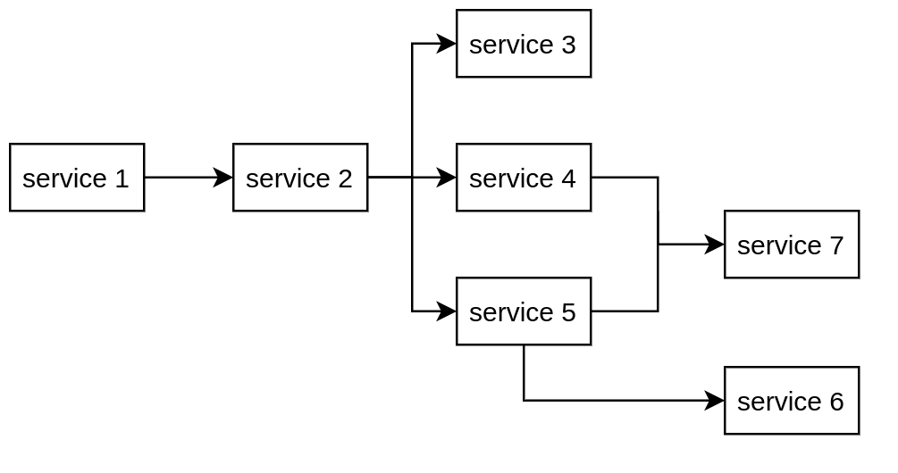

# Gitlab CI/CD multi-project

## 1. Setup project structure

- Using 7 service, some services need to wait others finish before start pipeline.



- Using atleast 3 runner

## 2. Solution for CI/CD

- For `service 1` to `service 2`, Gitlab CI support upstream and downstream to trigger pipeline using API [(read me)](<<https://docs.gitlab.com/ee/ci/multi_project_pipelines.html>). Using this code to trigger other pipeline.

```yml
trigger:
  variables:
    BASE_URL: "https://git.vmo.dev"
    APP_SERVICE_ID_2: 36
  stage: trigger
  script:
    - curl --request POST --form "token=$CI_JOB_TOKEN" --form ref=master $BASE_URL/api/v4/projects/$APP_SERVICE_ID_2/trigger/pipeline
  only:
    - master
```

- For `service 7`, pipeline from `service 4` and `service 5` must be done. Currently, gitlab not support waiting pipeline so we have to work around using pipeline trigger image [(click me)](https://gitlab.com/finestructure/pipeline-trigger). By using this image, we add this trigger in service 2 pipeline.

- We defined trigger pipeline 4 and 5 in 1 step and pipeline 7 in other step. Trigger will start pipeline 4 and 5 and wait respond, if pipeline success, job step will success, if one of two pipeline fail, step will fail and pipeline 7 will not be triggered.

- To using image, we need to generate `personal access token`, `pipeline trigger token` and `project id`. using code below to setup trigger:

```yml
trigger_pipeline_4:
  image: registry.gitlab.com/finestructure/pipeline-trigger
  stage: trigger
  script:
    - echo "trigger -a $ACCESS_TOKEN -p $PIPELINE_TOKEN_4 -t master $APP_SERVICE_ID_4"
    - "trigger -h git.vmo.dev -a $ACCESS_TOKEN -p $PIPELINE_TOKEN_4 -t master $APP_SERVICE_ID_4"
  tags:
    - docker
  only:
    - master
```
